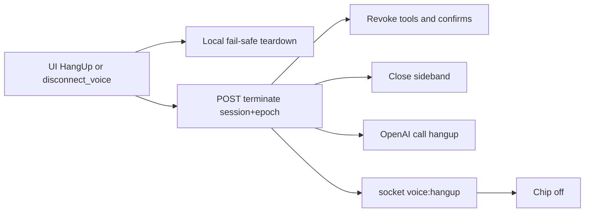

# DICKTATOR Final Build Plan (Guru-amended)

## Status

- Plan file: this doc. **Implementation not started** (await execute).
- Guru GRPT (`20260727_162504_febfd8`, ~18m): **NO-GO on V1 as originally written.**
- Residual risk called out: UI shows disconnected while orphan OpenAI session keeps billing **and** stale sideband/confirm can act on the wrong Cursor target.

## Locked product stance

- DICKTATOR is a **voice control layer over live Cursor sessions** (CursorRemote CDP), not a new coding agent.
- Live speech stays **OpenAI Realtime WebRTC**; OpenRouter is digests only.
- **V1 ship surface:** web client on CursorRemote (`voice-transport`). **V2:** Android phone. **V3:** Auto + capability packs.
- Safety is **server-owned**. Tool names matching Telegram do **not** inherit Telegram safety.

## Guru verdict → V1 cut

**Keep in V1**

- Direct UI hang-up + spoken `disconnect_voice` → same idempotent server terminate
- Explicit voice-session FSM, epochs, leases, orphan cleanup
- Server-owned confirmation invariants
- Enumerated closed tool set
- Stable, visible, revisioned sticky target; fail-closed mutations
- CDP / bridge health detection (recovery can wait)
- **One** evaluated Realtime model (Mini only after gate; else stay on proven full with hard budgets)
- Server-authoritative budget admission + enforcement
- Bounded idle **plus** absolute session timeout
- Protocol / fault-injection tests
- Safety / privacy / budget / recovery docs

**Defer from V1**

- Automatic mini/full routing and general reconnect-on-model-switch
- Rich multi-window narrated briefings / orientation on every reconnect
- Automatic CDP recovery
- Android-oriented API abstractions
- Capability packs

## Current baseline (already on branch)

- Sideband ephemeral auth, quota surfacing, CDP via WSL socat `:9333`, `/error` cache-bust, [`docs/dicktator.md`](file:///home/mrburns/Projects/cursor-ide-remote/docs/dicktator.md).
- Live defects: disconnect broken; no metering; default full 2.1; weak orientation/target awareness.

## V1 — Amended implementation

### 1. Voice-session FSM and hang-up (P0)

Files: [`voice.js`](file:///home/mrburns/Projects/cursor-ide-remote/src/client/voice.js), [`realtime-bridge.ts`](file:///home/mrburns/Projects/cursor-ide-remote/src/server/transports/voice/realtime-bridge.ts), [`tools.ts`](file:///home/mrburns/Projects/cursor-ide-remote/src/server/transports/voice/tools.ts), [`relay.ts`](file:///home/mrburns/Projects/cursor-ide-remote/src/server/relay.ts).

- States: `connecting → connected → disconnecting → disconnected` (plus error).
- Every event carries `sessionId` + `epoch`; ignore stale epochs.
- UI Hang Up **bypasses the model**; spoken `disconnect_voice` is a second entry to the **same** server terminate.
- Local fail-safe first: stop mic, detach remote audio, disable tools, cancel reconnect timers, close `RTCPeerConnection`.
- Server: revoke tool + confirmation authority **before/with** provider cleanup; close sideband; `POST …/realtime/calls/{id}/hangup`; emit `voice:hangup`.
- Bounded UI wait: after timeout → “local disconnect complete; server cleanup unconfirmed” (never hang forever; never claim verified teardown without ack).
- Lease/heartbeat + orphan reaper for tab close / crash / network loss.
- Spoken “disconnect” must **not** map to Cursor `cancel`/approve/reject — separate voice-session control namespace at the **dispatcher**, not the prompt.

### 2. Confirmation invariants (P0)

- Single-use confirm token: short TTL; bound to user, session, epoch, tool, canonical args digest, Cursor window/workspace, target revision.
- Atomic consume-and-execute; revalidate target at execution; fail closed if sideband/target unhealthy.
- Hang-up: invalidate all pending voice confirms immediately (never as Cursor reject).
- Idle/budget during confirm: stop new work; finite confirmation grace; then terminate or move confirm to non-voice UI.
- Target change or uncertain sideband reconnect: invalidate; require fresh explicit confirm (no auto-replay of approval).
- Prefer visible confirm for high-impact actions; do not rely on fuzzy spoken “yes”.

### 3. Sticky target + health (P0)

- Stable server-side target identity (not title alone) + revision/age; distinguish selected vs focused window.
- Panel always shows Target (or “no target”).
- Before each mutation: revalidate exact target; fail closed if missing/ambiguous/stale.
- Separate health chips/status: OpenAI voice, sideband, CursorRemote socket, CDP bridge, selected target.
- Short connect briefing from safe metadata only (bounded size; no terminal/secrets/source dump). Do not re-bill orientation on every transport reconnect unless target/policy changed.
- Improve non-active window status via WindowMonitor snapshots **without** treating display as authorization.

### 4. Budget + idle (P0)

- Server-authoritative account-keyed ledger (`data/voice-usage.json` or equivalent); atomic admission across tabs.
- Usage dedupe by session/epoch; versioned price table; timezone + daily reset.
- Fail closed on new Connect/upgrade when pricing/metering unknown or stale; reserve margin for unreported usage.
- Hard daily cap **and** per-session max; absolute wall-clock session limit independent of idle.
- One live provider session invariant; reconnect rate limit; orphaned-call reaper.
- Cap briefing / snapshot / tool-result payload sizes server-side.
- `budget_draining`: deny new turns/tools/reconnects/upgrades; only bounded existing confirm flow.
- Panel shows estimated/reported `$` distinctly from remaining budget.
- Idle policy: ambient noise and WindowMonitor ticks do **not** reset idle; assistant speech / committed tools defer within bounds; confirmation has finite grace; absolute session max always wins; warn before idle terminate.

### 5. Model policy (P0 gate)

- **No auto routing / reconnect-on-switch in V1.**
- Default candidate: `gpt-realtime-2.1-mini` **only after** fixed adversarial tool-calling eval vs full (disconnect vs cancel, negation, ambiguous target, malformed args, injection in tool output, non-allowlisted tools, etc.). Pass = zero unsafe executions in corpus + reliable disconnect-intent separation.
- Until Mini passes: ship one proven model (full 2.1) with hard budgets.
- Optional later: explicit one-shot user-approved upgrade at clean boundary (not mid-tool/confirm/teardown), budget-reserved, new epoch — not “auto”.

### 6. Tests and docs (P0)

- Protocol/fault matrix (not just happy smoke): dead sideband/socket/CDP; reordered/duplicate teardown; tab close orphan; old-epoch events; two-tab budget race; delayed usage; confirm replay/expiry/arg mutation/wrong target; idle while speaking/tooling/confirming; provider usage stops within teardown bound.
- Human/agent smoke remains final journey only.
- Update [`docs/dicktator.md`](file:///home/mrburns/Projects/cursor-ide-remote/docs/dicktator.md): FSM, confirms, budget/idle, health, tool allowlist, recovery.

## V2 / V3 (unchanged sequencing)

- **V2:** thin Android against proven web session APIs (Hang Up notification, Bluetooth, push for approvals). No Auto.
- **V3:** Android Auto (Talk / Approve / Later / Hang Up) + optional Graphiti/Graphify/repo/DB packs.

## Explicit non-goals for V1

- OpenRouter as live Realtime replacement
- Auto routing / model-switch reconnect as product features
- Graphiti/Graphify/DB tools
- Android / Android Auto
- Expanding beyond enumerated closed tool set (except `disconnect_voice` + metering/terminate APIs)

## Guru session

- Resume: `hermes --resume 20260727_162504_febfd8 -p valuer-gated`
- Full log: `/tmp/dicktator-guru-review.txt`
